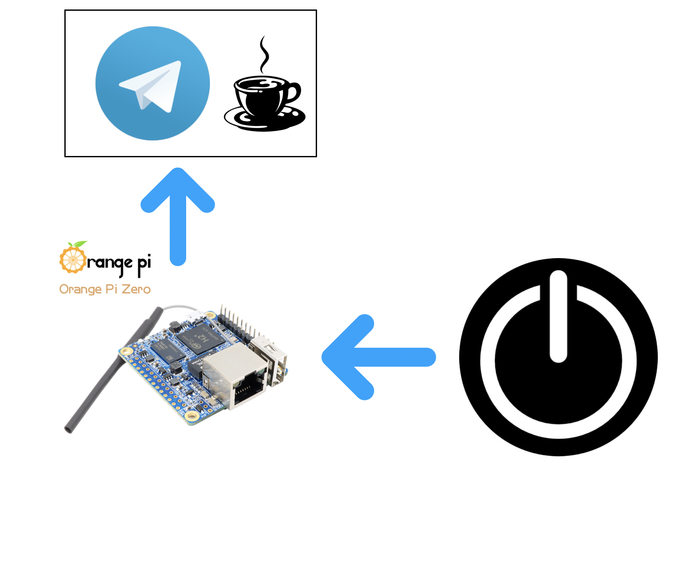

# coffee-bot
<h1>How to use:</h1>
<ul>
  <li>git clone https://github.com/aplinxy9plin/coffee-bot.git</li>
  <li>cd coffee-bot</li>
  <li>sudo apt-get install npm</li>
  <li>sudo sh start.sh</li>
</ul>
<h1>How it works</h1>

